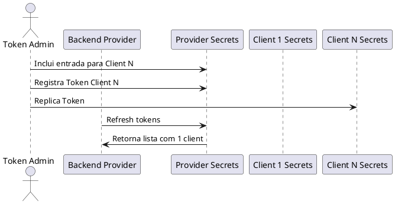

@startuml "Autenticação com rotacao automatica"
participant "Token Admin" AS TA
participant "Provider Secrets" as PS
participant "Client 1 Secrets" as C1S
participant "Backend Provider" as BP
participant "Client 1" as C1
participant "Deploy" as Deploy
participant "SRE"

TA -> PS: Registra token 1
PS -> C1S: Replica token 1
Deploy -> C1S: Solicita segredo atual
C1S -> Deploy: Retorna token
Deploy -> C1: Deploy com token 1
C1 -> BP: Autentica com token 1
PS -> BP: Refresh tokens
BP -> BP: Valida token 1
BP -> C1: Retorna resultado

TA -> PS: Gera e registra Token 2
PS -> C1S: Atualiza para token 2
TA --> SRE: Notifica atualização

SRE -> Deploy: Dispara/schedula redeploy
Deploy -> C1S: Solicita novo segredo 
C1S -> Deploy: Retorna token 2
Deploy -> C1: Deploy com token 2
PS -> BP: Refresh tokens

C1 -> BP: Autentica com Token 1
BP -> BP: Valida token 1 ou 2
BP -> C1: Retorna resultado

C1 -> BP: Autentica com Token 2
BP -> BP: Valida token 1 ou 2
BP -> C1: Retorna resultado

TA --> SRE: Notifica Bloqueio do Token 1
TA -> PS: Expira Token 1
PS -> PS: Descarta token 1
PS -> BP: Refresh tokens

C1 -> BP: Autentica com Token 1
BP -> BP: Valida token 2
BP -> C1: Rejeita acesso

@enduml

@startuml "Applicacao Provider"
actor "Token Admin" AS TA
participant "Backend Provider" as BP
participant "Provider Secrets" as PS
participant "Client 1 Secrets" as C1S
participant "Client N Secrets" as CNS

PS -> BP: Refresh tokens
BP -> BP: Atualiza lista de clients
BP -> BP: Atualiza tokens Client 2 [Token 1 e 2]

TA -> PS: Registra Client 1 - token 1
PS -> C1S: Replica token 1
TA -> PS: Registra Clien 2 - token 1
PS -> CNS: Replica token 1

PS -> BP: Refresh tokens
BP -> BP: Atualiza lista de clients
BP -> BP: Atualiza tokens Client 1
BP -> BP: Atualiza tokens Client 2

@enduml

@startuml "Criando um Provider"
actor "Token Admin" AS TA
participant "Backend Provider" as BP
participant "Provider Secrets" as PS
participant "Client 1 Secrets" as C1S
participant "Client N Secrets" as CNS

TA -> BP: Cria Cofre do Provider
TA -> BP: Cria Lista de Clients vazia

@enduml

## Como expirar um token?

Existe propriedade "delete_version_after    Ns" que pode ser validada
A expiração será automática, porém, sem notificação
- Testar

## Criando um Provider

@startuml "Acrescentando um token"
actor "Token Admin" AS TA
participant "Provider Secrets" as PS
participant "Client 1 Secrets" as C1S
participant "Backend Provider" as BP
participant "Client 1" as C1
participant "Deploy" as Deploy
participant "SRE"

TA -> PS: Gera e registra Token 2
PS -> C1S: Atualiza para token 2
TA --> SRE: Notifica atualização

TA -> PS: Expira Token 1
TA --> SRE: Notifica Bloqueio do Token 1
PS -> PS: Descarta token 1

@enduml
